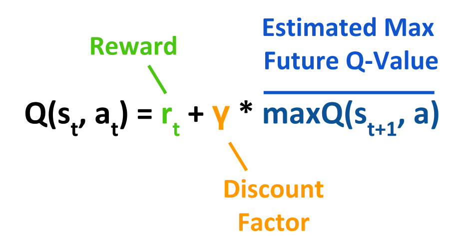
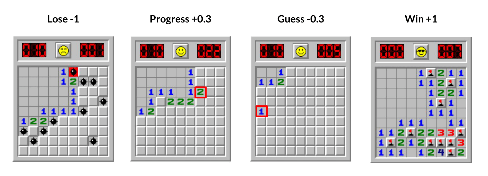

## I trained an A.I. to beat Minesweeper.. without teaching it any rules!

Of course, since this is a Reinforcement Learning project, the above statement should be a given. After all, Reinforcement Learning is all about having a machine learning model improve through trial-and-error. Below is a comparison of a model playing Minesweeper before training and after training on ~half a million games!

<p align="center">
  
</p>  

### Acknowledgments
Some code in this repo were adapted from:
- [Sentdex's Deep-Q Learning Tutorial Series](https://www.youtube.com/watch?v=yMk_XtIEzH8&ab_channel=sentdex)
- [jakejhansen's Github Repo](https://github.com/jakejhansen/minesweeper_solver)


## Table of Contents
1. [Introduction to Minesweeper](#intro)
2. [Reinforcement Learning](#RL)
3. [Deep Q-Learning Networks](#DQN)
4. [Using Reinforcement Learning to Beat Minesweeper](#MS)

### Introduction: The Game of Minesweeper <a name='intro'></a>

Minesweeper is a classic game of logic, dating back to 1989. The objective - click on all tiles except the ones containing mines. By clicking on tiles you reveal numbers which indicate how many mines are in the tiles around them. You progress through the game by revealing numbers and deducing where it is safe to click next.

**Can a computer learn to beat Minesweeper?**

Given the logical rules of the game, Minesweeper can actually be solved using brute force algorithms such as a combination of if-else statements. This means that a computer solver can be obtained by explicitly programming it to take specific actions from specific states. But can a computer *learn* to play Minesweeper without these clear-cut commands? In other words, can a computer learn the logic of Minesweeper without it being aware of the rules firsthand?

This is where Reinforcement Learning comes in!

### What is Reinforcement Learning? <a name='RL'></a>

Reinforcement Learning (RL) is an area of machine learning that aims to train a computer to accomplish a task. The following are the key components of RL:


- **The Reward Structure**: Rather than explicit rules, we indicate to the computer what is beneficial or detrimental to performing a task by assigning rewards and/or penalties on specific conditions.
- **The Agent**: This is essentially the computer, which takes actions on the **environment** based on what it thinks will result the highest reward / lowest penalty.
- **The Environment**: This is the game. Its state is updated every time the **agent** takes an action. Each action is assigned a reward based on our **reward structure**. The environment's current state, action, reward and new state are collectively called a **transition**. The current state and reward are fed back to the agent so that it can learn from these experiences. By accumulating experience, the agent develops a better **policy** (*i.e.* behaviour) in performing the task at hand.

So the goal of RL is for the **Agent** to learn an optimal **policy** by pursuing actions that return the greatest reward. There are several different types of RL algorithms. In this project, I used a **Deep Q-learning Network** (DQN).

### What is a Deep Q-learning Network? <a name='DQN'></a>

First, let's define Q-learning. Q-learning involves having a reference table of Q-values (a Q-table) with all possible states as rows and all possible actions as columns. Actions are chosen based on the maximum quality-value ( **Q** ) for all possible actions in a given state ( **s** ). Q-values are initialized randomly (typically at 0) and are updated as the agent plays the game and observes rewards for its actions. Note that Q-values have no inherent meaning outside of the context of a specific Q-learning problem - they simply serve to compare the value of actions relative to each other.

However, Q-learning becomes unfeasible if the number of possible states and actions are large - the Q-table would take up too much memory! Bypassing this limitation is a combination of Deep Learning and Q-learning (aptly named Deep Q-learning) which uses a neural network to approximate the Q-function. Deep Q-learning also has the advantage of being able to generalize. If you encounter a state that is outside of the discrete combinations that an agent has seen in Q-learning, it will act randomly (since Q-values are initialized randomly). On the other hand, Deep Q-learning can recognize new states based on their similarity to ones it has seen before and act accordingly.

I mentioned the Q-function. Well this is the core algorithm of Q-learning, and is derived from the **Bellman Equation**:


<p align='center'>
  
</p>


Put simply, the updated Q-value is the immediate reward (r) plus the highest possible Q-value of the next state, multiplied by a **Discount Factor ( γ )** (More on this in a bit). As you maybe realized, this is basically a regression problem with the above being the target variable!

The **Discount Factor** is a hyperparameter that ranges from 0 to 1 and indicates how much weight is given to future rewards: a value closer to 1 places more weight to future rewards while a value closer to 0 places less weight (more discount). Say a game has the option to fight Wario with a prize of 10,829 coins (a very high reward) for beating him. However, fighting Wario requires you to take damage (which gives negative reward). With **γ** set close to 0, your agent may learn to avoid fighting Wario altogether, as the reward for beating him is heavily discounted and thus not worth the damage it would take to fight him. With **γ** close to 1, your agent may opt to fight Wario since it values the reward for beating him very highly despite the damage required to do so.

> Sidenote: In Minesweeper, the discount factor is not so important since every action that does not reveal a mine, be it sooner or later, has equal value in progressing towards the end goal: solving the board. In fact, [Hansen and others (2017)](https://github.com/jakejhansen/minesweeper_solver/blob/master/article.pdf) showed that γ=0 resulted in higher win-rates than with γ=0.99 for their Q-learning Minesweeper implementation.

But wait! If an agent starts with no experience, and is always choosing the action that returns the highest reward, it would never learn to beat Wario in the first place, right? Right! Since the agent begins without the experience of beating Wario, it does not know about the juicy 10,829 coins and will thus learn to avoid the negative reward taken from fighting him (This behaviour can be described as acting greedily). For an agent to find new valuable policies, it needs to explore new actions. This is where the hyperparameter, epsilon ( **ε** ) comes in.

**ε** is the probability of exploring (acting randomly) vs. exploiting (acting based on maximum Q). If **ε** is 0.9, your agent will act randomly 90% of the time and exploit prior knowledge (use maximum Q) 10% of the time. Typically, **ε** is set to be high (>=0.9) at the start and decayed to a lower value as training progresses. This allows your agent to sufficiently explore and generate experience before gradually transitioning to a policy based on exploitation. The following is python code implementing **Epsilon-Greedy**: choosing an action based on current Q-value estimates with probability 1-epsilon, and random otherwise.


```python
epsilon = 0.9

rand = np.random.random() # random value b/w 0 & 1

if rand < epsilon:
    move = np.random.choice(actions)
else:
    moves = model.predict(state) # model is your neural network
    move = np.argmax(moves)
```


Two other concepts that were key to recent improvements in deep reinforcement learning are **Experience Replay** and **Double Deep Q-Learning Networks**:

**Experience Replay:** As opposed to feeding in consecutive state-action pairs as they occur to our neural network, we instead store the agent's experiences and randomly sample from this stored experience to train our network. If the network trains only on consecutive batches of experience, it may overfit due to these samples being highly correlated. Random sampling of past experience breaks these correlations and therefore enables more efficient learning. The stored experience is also referred to as the replay buffer, the minimum and maximum size of which may require tuning. More important is the maximum replay buffer size: too small and your buffer might be too concentrated with recent experience leading to overfitting. Too big and your buffer might be too diluted with past experience which may slow down the rate at which your model learns from more recent experience.

**Double Deep Q-Learning Networks (DDQN):** Instead of one network estimating Q and updating based on its own estimates, we use two networks, one for action selection and one for action evaluation. The rationale behind this is to avoid overestimation bias - since we are taking the maximum of estimated Q-values, our model tends to overestimate them. To elaborate, say the true Q-value for all actions equal 0 and our estimates are distributed such that some are greater than 0 and some are lower. The maximum of these estimates is obviously above 0 and hence, an overestimate. The solution is to use two separate models, the primary model and the target model. The primary model is updated at every step and used to select actions. The target model is used to estimate the maximum Q-value which are used to train the primary model. The parameters of the primary model are periodically copied (or averaged) over to the target model every so often (another parameter you can adjust), leading to more stable training. Here is experience replay and double DQN implemented in python:


```python
# code was adapted from this [blog](https://pythonprogramming.net/training-deep-q-learning-dqn-reinforcement-learning-python-tutorial/?completed=/deep-q-learning-dqn-reinforcement-learning-python-tutorial/)
BATCH_SIZE = 64
DISCOUNT = 0.9
UPDATE_TARGET_EVERY = 5
target_update_counter = 0

# batch contains a random sample of (state, action, reward, new_state) transitions
batch = random.sample(replay_buffer, BATCH_SIZE)

# model and target_model are your primary and target model, respectively
current_states = np.array([transition[0] for transition in batch])
current_qs_list = model.predict(current_states)

new_current_states = np.array([transition[3] for transition in batch])
future_qs_list = target_model.predict(new_current_states)

X,y = [], []

# done is a boolean that is True if the game is at a terminal state
for i, (current_state, action, reward, new_current_state, done) in enumerate(batch):
    if not done:
        max_future_q = np.max(future_qs_list[i])
        new_q = reward + DISCOUNT * max_future_q
    else:
        new_q = reward

    current_qs = current_qs_list[i]
    current_qs[action] = new_q

    X.append(current_state)
    y.append(current_qs)

model.fit(np.array(X), np.array(y), batch_size=BATCH_SIZE, shuffle=False)

# Update target network counter every episode
if done:
    target_update_counter += 1

# Update target network with weights of primary network, every 5 episodes
if target_update_counter > UPDATE_TARGET_EVERY:
    target_model.set_weights(model.get_weights())
    target_update_counter = 0
```


Hope the above helps you understand the concepts around DQNs and perhaps even helps you implement your own Reinforcement Learning project! Now I'll go into explaining my Minesweeper DQN agent.

## Using Reinforcement Learning to Beat Minesweeper <a name='MS'></a>

My custom Minesweeper Agent class can be found in [MinesweeperAgent.py](). The Minesweeper Agent is initialized by specifying the number of rows, columns and mines of the board it will play like so:

```python
# dimensions and mine number for Beginner mode
agent = MinesweeperAgent(9, 9, 10)
```

The state of a Minesweeper board is represented as an image with dimensions being equal to that of the board. Number tiles are represented by integers ranging from 1 to 8. 0 represents an empty tile, -1 represents unknown and -2 represents a bomb. These integers are scaled to be between -1 and 1 by dividing by 8.

The reward structure for my Minesweeper agent is as follows:

<p align='center'>
  
</p>

> The red boxes indicate the most recent action taken. Progress is for moves that have at least one already revealed tile around them while guesses are moves that are completely isolated from revealed tiles.

This reward structure is almost identical to the one used in [jakejhansen's Github Repo](https://github.com/jakejhansen/minesweeper_solver). A guess is given a negative reward because although it can reveal safe squares, it does so through luck rather than logic. My reward structure (and my agent) differs from the one referenced above by excluding non-progress moves (clicking on already revealed tiles) altogether. This speeds up training because the agent does not waste time learning to not click on already clicked-on squares. I do this by simply lowering the Q-values for already revealed squares to the minimum Q-value so that the agent will be guaranteed to pick the maximum Q-value among the unsolved squares:


```python
def get_action(self, state):
    board = state.reshape(1, self.ntiles)
    # unknown is -0.125 after scaling
    unsolved = [i for i, x in enumerate(board[0]) if x==-0.125]

    rand = np.random.random() # random value b/w 0 & 1

    if rand < self.epsilon: # random move (explore)
        move = np.random.choice(unsolved)
    else:
        moves = self.model.predict(state.reshape((1, self.nrows, self.ncols, 1)))
        moves[board!=-0.125] = np.min(moves) # set already clicked tiles to min value
        move = np.argmax(moves)

  return move
```

As in [Sentdex's Deep Q-learning tutorial](https://www.youtube.com/watch?v=t3fbETsIBCY&list=PLQVvvaa0QuDezJFIOU5wDdfy4e9vdnx-7&index=5&ab_channel=sentdex), I used a Tensorboard to track the performance of my models. The Tensorboard class was modified to *not* output a log file every time .fit() is called (default behaviour). If using Tensorflow version 2+ use [my_tensorboard2.py](https://github.com/sdlee94/Minesweeper-AI-Reinforcement-Learning/blob/master/my_tensorboard2.py), otherwise use [my_tensorboard.py](https://github.com/sdlee94/Minesweeper-AI-Reinforcement-Learning/blob/master/my_tensorboard.py).
