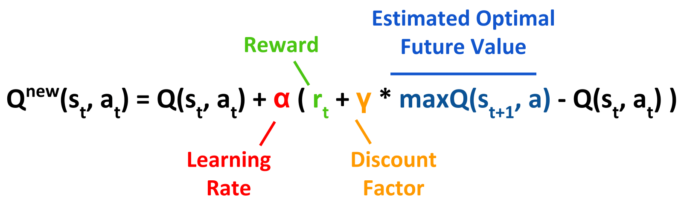

## I trained an A.I. to beat Minesweeper.. without teaching it any rules!

Of course, since this is a Reinforcement Learning project, the above statement should be a given. After all, Reinforcement Learning is all about having a machine learning model improve through trial-and-error. Below is a comparison of a model playing Minesweeper before training and after training on ~half a million games!

<p align="center">
  
</p>  

## Table of Contents
1. [Introduction to Minesweeper](#intro)
2. [Reinforcement Learning](#RL)
3. [Deep Q Learning](#DQN)

### Introduction: The Game of Minesweeper <a name='intro'></a>

Minesweeper is a classic game of logic, dating back to 1989. The objective - click on all tiles except the ones containing mines. By clicking on tiles you reveal numbers which indicate how many mines are in the tiles around them. You progress through the game by revealing numbers and deducing where it is safe to click next.

**Can a computer learn to beat Minesweeper?**

Given the logical rules of the game, Minesweeper can actually be solved using brute force algorithms such as a combination of if-else statements. This means that a computer solver can be obtained by explicitly programming it to take specific actions from specific states. But can a computer *learn* to play Minesweeper without these clear-cut commands? In other words, can a computer learn the logic of Minesweeper without it being aware of the rules firsthand?

This is where Reinforcement Learning comes in!

### What is Reinforcement Learning? <a name='RL'></a>

Reinforcement Learning (RL) is an area of machine learning that aims to train a computer to accomplish a task. The following are the key components of RL:


- **The Reward Structure**: Rather than explicit rules, we indicate to the computer what is beneficial or detrimental to performing a task by assigning rewards and/or penalties on specific conditions.
- **The Agent**: This is essentially the computer, which takes actions on the **environment** based on what it thinks will result the highest reward / lowest penalty.
- **The Environment**: This is the game. Its state is updated every time the **agent** takes an action. Each action is assigned a reward based on our **reward structure**. The environment's current state, action, reward and new state are collectively called a **transition**. The current state and reward are fed back to the agent so that it can learn from these experiences. By accumulating experience, the agent develops a better **policy** (*i.e.* behaviour) in performing the task at hand.

So the goal of RL is for the **Agent** to learn an optimal **policy** by pursuing actions that return the greatest reward. There are several different types of RL algorithms. In this project, I used a **Deep Q-learning Network** (DQN).

### What is a Deep Q-learning Network?

First, let's define Q-learning. Q-learning involves having a reference table of Q-values with all possible states as rows and all possible actions as columns. Actions are chosen based on the maximum quality-value ( **Q** ) for all possible actions in a given state ( **s** ). Q-values are initialized randomly (typically at 0) and are updated as the agent plays the game and observes rewards for its actions. Note that Q-values have no inherent meaning outside of the context of a specific Q-learning problem - they simply serve to compare the value of actions relative to each other.

So how are Q-values updated? The core algorithm of Q-learning is the Q-function, which is derived from the **Bellman Equation**:


<p align='center'>
  
</p>


Put simply, the updated Q-value is the immediate reward (r) plus the highest possible Q-value of the next state, multiplied by a **Discount Factor** ( **γ** ). The **Discount Factor** ranges from 0 to 1 and indicates how much weight is given to future rewards: a value closer to 1 places more weight to future rewards while a value closer to 0 places less weight (more discount). In other words, **Discount Factor** is a hyperparameter that controls how much your agent pursues immediate rewards vs. future rewards. For example, say a game gives you the option to fight Bowser that will likely give you damage and thus, accrue negative reward. However, beating Bowser awards you with 10,829 coins that translates to a very high reward. With **γ** set close to 0, your agent may learn to avoid fighting Bowser altogether, as the reward for beating him is heavily discounted and thus not worth the damage it would take to fight him. With **γ** close to 1, however, your agent may opt to fight Bowser since it values the reward for beating him very highly despite the damage (negative reward) required to do so.

> Sidenote: In Minesweeper, the discount factor does not matter so much

But wait! If an agent is always choosing the action that returns the highest reward, it would never choose to fight Bowser in the first place, right? Right! Since the agent begins without the experience of beating Bowser, it does not know about the juicy 10,829 coins. Here comes in the second hyperparameter: epsilon ( **ε** )

Let's watch Q-learning at work with the example below. We start with a Q-table with all Q-values initialized at 0. We can see that

At a given time **t**, the agent selects an action ( **α<sub>t</sub>** ), gets a reward ( **r<sub>t</sub>** ) and the state is updated ( **s<sub>t</sub>** --> **s<sub>t+1</sub>** ).

You could think of the boxed portion of the equation as the target variable.

```python
# model is your neural Network,
# done is a boolean that is True if the game is at a terminal state
discount = 0.9
if not done:
  new_q = reward + discount * np.max(model.predict(state))
else:
  new_q = reward
```


## Neural Network Architechture
